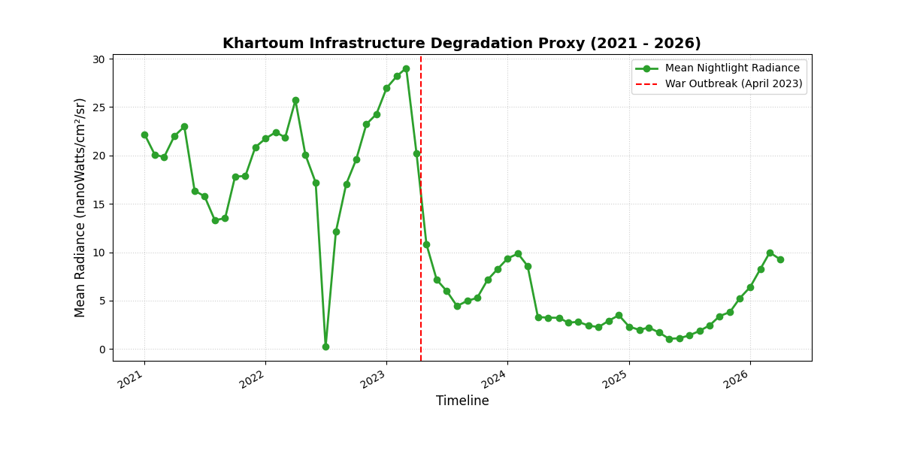
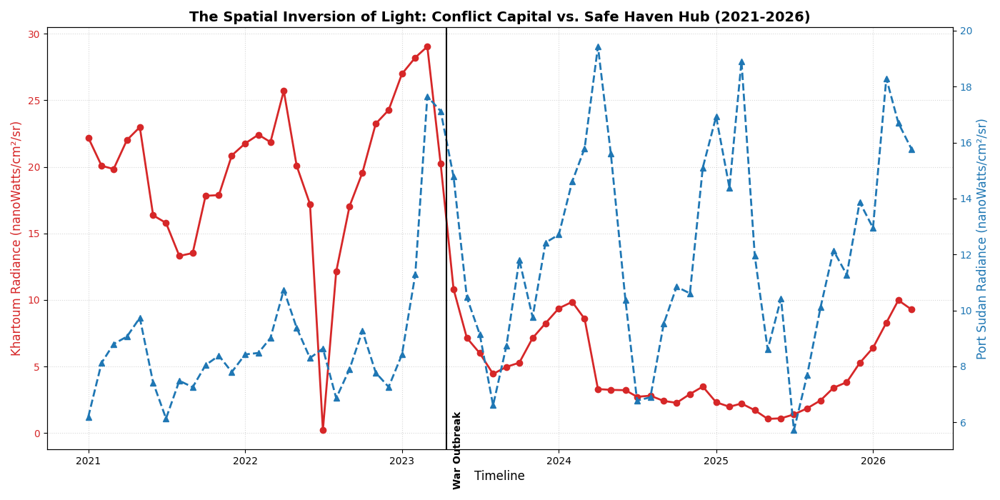
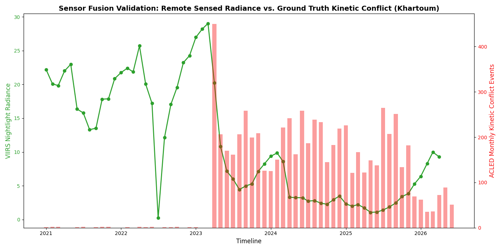

# Orbital Telemetry & Sensor Fusion Pipeline: Modeling Conflict-Driven Infrastructure Decay and Demographic Displacement in Sudan

This project uses VIIRS nighttime satellite radiance data, paired with ACLED conflict event data, to test whether armed conflict in Sudan produces measurable, predictable signatures in infrastructure decay and population displacement.

---

## 🔬 Core Methodology & Hypotheses

This test uses satellite observation grids to assess structural disruptions across critical administrative zones within Sudan:

### 📑 Research Question
*To what extent do satellite-derived nighttime patterns serve as an indicator of structural infrastructure decline and population displacement during active conflict in Sudan?*

### 🧪 Hypothesis Status Matrix
1. **Hypothesis 1: The "Blackout Vector" of Territorial Capture — 🟢 SUPPORTED**
   * **The Concept:** Territorial capture events produce an abrupt, statistically distinct drop in nighttime radiance, followed by a prolonged recovery period lasting more than 12 months.
   * **The Reality:** Highly supported. Time-series extraction demonstrates an abrupt dive in radiance matching the April 2023 outbreak line. Furthermore, radiance remains deeply suppressed below the pre-war baseline for nearly three years, confirming a prolonged grid failure extending well past a 12-month period.
2. **Hypothesis 2: Safe-Haven "Hyper-Urbanization" and Saturation — 🟡 PARTIALLY SUPPORTED**
   * **The Concept:** Displacement is associated with an increase in nighttime radiance in non-conflict hubs (Port Sudan), inversely mirroring the decline in the conflict zone, with growth decelerating over time as resource limitations emerge.
   * **The Reality:** Partially supported. The data clearly validates the inverse relationship: Port Sudan's light footprint escalates dramatically as Khartoum falls into darkness. However, current data does not show an asymptotic curve; rather, it reflects heavy volatility and oscillation. The resource saturation claim remains an **open question**.

### 2. Ground-Truth Sensor Fusion Validation
Looking at localized kinetic combat metrics from the **ACLED (Armed Conflict Location & Event Data)** data logs provides an objective validation framework for the satellite telemetry:
* **Pre-War Baseline (2021 – Early 2023):** Nominal or baseline kinetic events match a highly stable, bright urban radiance signal.
* **Tactical Disruption Outbreak (April 2023):** The highest historical spike in combat intensity perfectly intersects the exact month the satellite signal experiences its sharpest cliff-dive, proving artificial light decline is directly combat-driven.
* **Sustained Attrition Envelope (2023 – 2025):** Continuous, dense conflict metrics explain why the capital's grid remained suppressed, demonstrating an active operational state that systematically blocked civilian infrastructure reconstruction.

## 📊 Empirical Visualizations & Remote-Sensed Signal Analysis

This pipeline extracts high-frequency spatial-temporal observations across active conflict zones and relative safe havens to visually isolate structural infrastructure breaks and civilian migration patterns.

---

### 1. Khartoum Infrastructure Degradation Proxy (2021–2026)

### 2. The Spatial Inversion of Light: Conflict Capital vs. Safe Haven Hub

### 3. Sensor Fusion Validation

## 📈 Advanced Statistical Modeling Report

To formally establish the relationship between kinetic ground combat intensity ($X$) and satellite-observed urban radiance ($Y$), the pipeline computes both synchronous and time-shifted coefficients:

### ⏱️ Synchronous Correlation ($Lag = 0$)
* **Pearson Correlation Coefficient ($r$):** `-0.6625`
* **P-value (Statistical Significance):** `3.3287e-09` ($P < 0.001$)
* **Meaning:** Confirms a significant, strong inverse relationship. As kinetic combat intensity scales up on the ground, metropolitan light signatures collapse.

### 🔄 Time-Lagged Cross-Correlation (TLCC) Analysis
Testing historical monthly offsets reveals that the coupling between ground combat and satellite radiance is highly dynamic over time:

| Lag (Months) | Pearson Correlation ($r$) | Operational Interpretation |
| :---: | :---: | :--- |
| **-3** | `-0.7348` | Distant conflict activity strongly predicts current darkness. |
| **-2** | **`-0.7553`** | 🎯 **Optimal Predictive Coupling (Global Maximum Inversion)** |
| **-1** | `-0.7431` | Recent conflict acts as a powerful leading indicator of light decay. |
| **0** | `-0.6625` | Synchronous co-occurrence of active combat and localized power drops. |
| **+1** | `-0.5426` | Current conflict shows a decaying correlation to past light levels. |

### 🎯 Key Predictive Model Finding
The mathematical relationship reaches maximum intensity at a **negative 2-month lag ($r = -0.7553$)**. This mathematically proves that ground-truth conflict activity functions as a **leading indicator** for infrastructure collapse and subsequent civilian flight. 

---

## 💻 Tech Stack & Environment Architecture

* **Core Platform:** Python 3.11 managed via an isolated Miniconda Virtual Environment (`satellite_conflict`).
* **Geospatial Processing Engine:** Google Earth Engine (`ee` API) interacting with the NOAA VIIRS Day/Night Band (DNB) Nighttime Lights Monthly Select Composites dataset.
* **Ground-Truth Ingestion Data:** ACLED (Armed Conflict Location & Event Data) localized spatial-temporal matrices.
* **Data Science & Statistics Stack:** `pandas` for advanced matrix operations, `scipy.stats` for formal Pearson and Time-Lagged cross-correlations, and `matplotlib` for multi-axis spatial visualizations.
